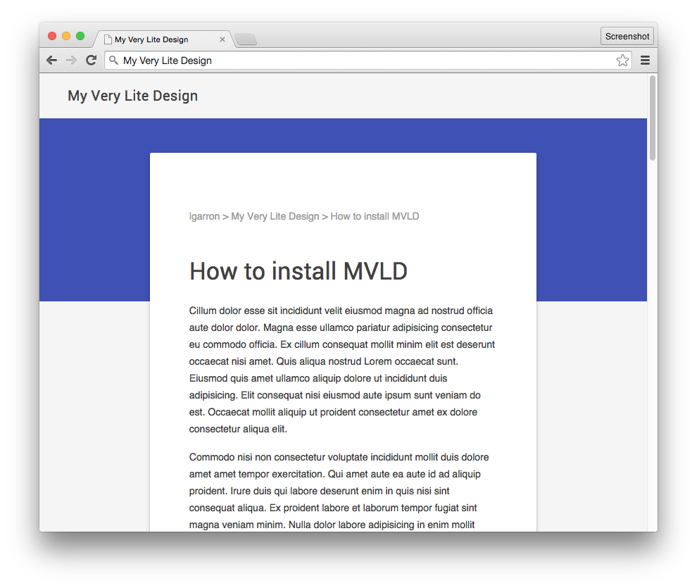
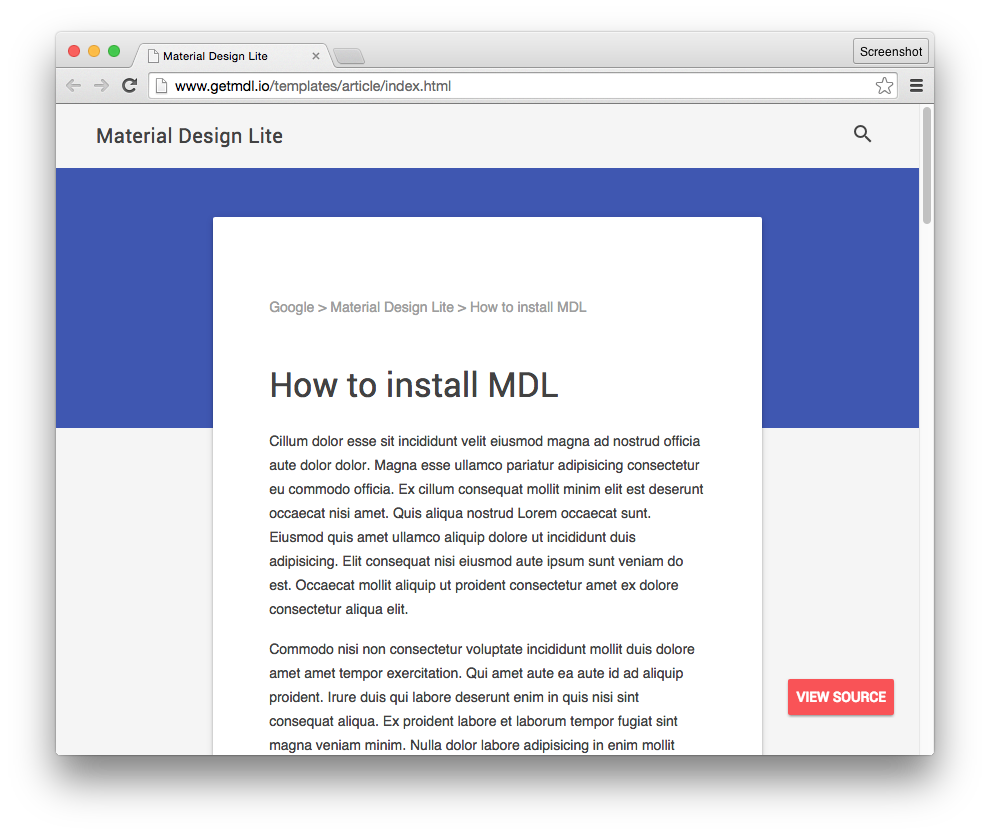

# My Very Lite Design

This is a hand-minimized version of the Material Design Lite ["Article" template](http://www.getmdl.io/templates/article/index.html) template. It uses only 4 `
` elements (instead of 22) and 9 CSS rules (rather than > 1000), so that it can be used as a lightweight template. The following have been removed:

- Search box (allows getting rid of Javascript)
- "View source" link
- Footer

Apart from these, the visual match with [the original template](http://www.getmdl.io/templates/article/index.html) is nearly pixel-perfect, if you include the Roboto font. (If you leave out the font, the title and the content headings will only change a little.)

## My Very Lite Design

## Original Template

## License

Apache 2.0.  
This is a fork of of [`google/material-design-lite`](https://github.com/google/material-design-lite)